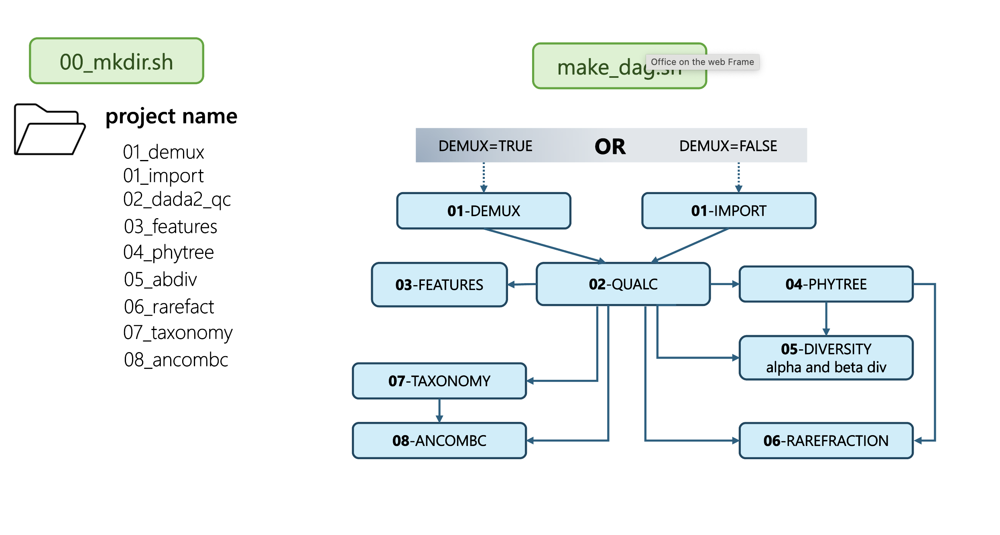

# 16S rRNA Amplicon Sequencing Pipeline [HTCondor + DAGman]

## 📘 Introduction

This DAGMan pipeline is built upon QIIME2 and designed to run within HTCondor using the DAGMan workflow manager. It streamlines the analysis of short-read 16S rRNA amplicon sequencing data to characterize sample microbiomes through automated, reproducible, customizable steps. The workflow includes multiple interdependent jobs that generate key microbiome outputs such as phylogenetic trees, diversity metrics, taxonomic summaries, and differential abundance analyses. By leveraging containerized QIIME2 tools within HTCondor, this pipeline provides an efficient and modular framework for conducting large-scale microbiome studies.

## 🧩 Workflow

## 📚 Documentation
Full documentation is available here: [pipeline documentation](https://uw-madison-bacteriology-bioinformatics.github.io/16S_microbiome_wf/)

## 💬 Help:
Patricia Q. Tran, ptran5@wisc.edu, University of Wisconsin-Madison Get Help:
- For people at UW-Madison, please visit the [departmental bioinformatics research support service main website](https://bioinformatics.bact.wisc.edu/). If you are part of the Department of Bacteriology please make an 1-on-1 individual appointment, others please attend one of my weekly office hours.
- For external people, please submit an issue via the github page.
