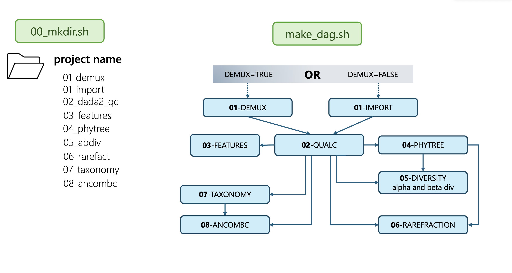

# 16S rRNA Amplicon Sequencing Pipeline [HTCondor + DAGman]

Welcome to the documentation for the **16S rRNA analysis pipeline**.  
This guide walks you through the setup, execution, and customization of your workflow on CHTC.

**Program:** This DAGman pipeline is based upon QIIME2 and documentation and utilizes a QIIME2 container. It is meant to be run within HTCondor using a DAGMan workflow manager. Please see the Reference tab in the navigation page for the qiime2 citation.

**Purpose:** The purpose of this pipeline is to analyze short-read amplicon 16S rRNA sequencing data to characterize the microbiome of the samples. The workflow consists of 9 jobs that build upon one another, and generates outputs that are relevant to general microbiome questions (including but not limited to phylogenetic trees, diversity and taxonomic analyses, and differential abundance testing results). These processes are often time-consuming and complicated, and involve multiple dependencies. By working in HTCondor and DAGman, this pipeline allows researchers to streamline their data analysis in a reproducible and effective manner.

**Uses:** This pipeline can be used to assess bacterial communities and generate visualizations based off of their data. Due to its reproducibility, and modular nature, scripts can be modified as needed for custom analyses. It is highly recommended to consult the documentation listed in References below if one is interested in working with this version.

## Diagram with steps of pipeline

## Special Considerations
* Do not include any personal information in the data input into the pipeline.
* Please set up a staging folder with CHTC before trying this pipeline. It is meant to process large amounts of data that your home directory may not neccessarily be able to manage.

