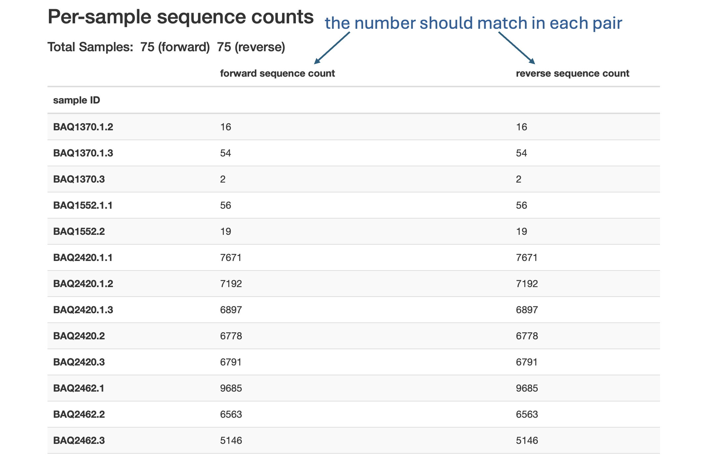
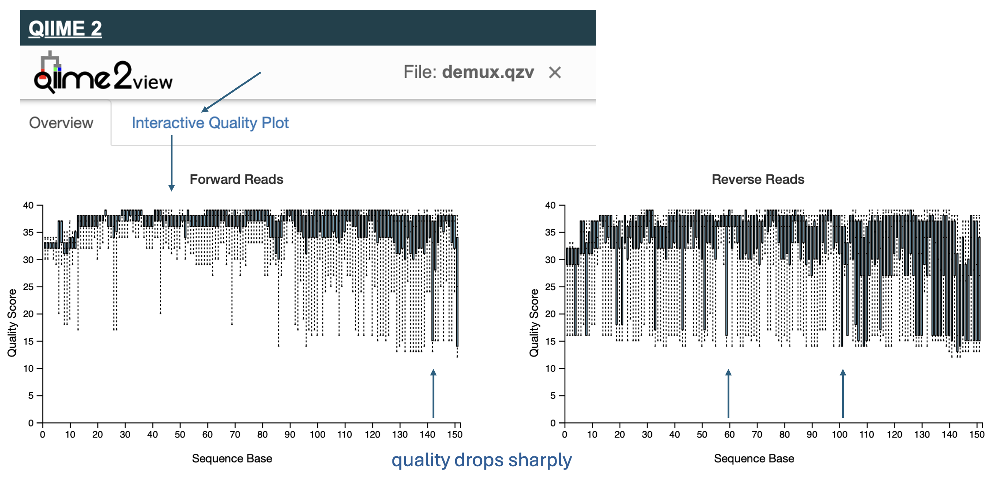

## Demultiplexing

**Files:** `demux.qzv`  

**Purpose:** Provides basic statistics and quality information about your raw input reads.  

- **Sequence count summary:** Check the number of forward and reverse reads for each sample.  
  - The counts should roughly match.  
  - Large mismatches may indicate pairing or sequencing issues.  

- **Interactive quality plot:** Displays the average quality score per base position.  
  - Look for the position where the quality drops sharply.  
  - This helps you decide your **trimming lengths** for DADA2.

