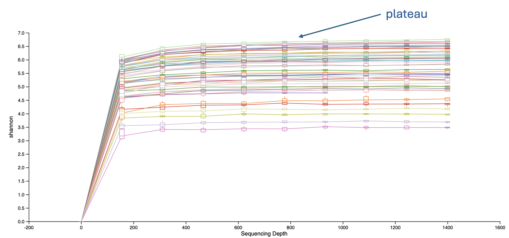

## Rarefaction Curves

**File:** `alpha-rarefaction.qzv`  

**Purpose:** Visualizes sequencing depth vs. observed diversity.  

**Interpretation:**  
- Look for a **plateau** in the curve.  
- Plateau = sufficient sequencing depth; no need for deeper sequencing.  
- If the curve is still rising, some samples might need higher read depth.

