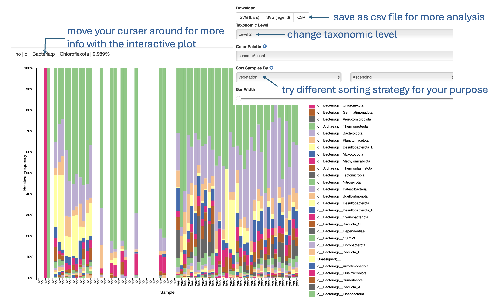

## Taxonomic Analysis

**File:** `taxa-bar-plots.qzv`  

**Purpose:** Displays the taxonomic composition of samples at multiple classification levels.

**Interpretation:**
- Visualizes the relative abundance of taxa at different **taxonomic levels** (domain to species).  
- Change the **taxonomic level** (e.g., level 2 = phylum, level 3 = class).  
- Most informative levels are typically **2 or 3**.  
- You can:
  - Sort samples by metadata category.  
  - Export the visualization as CSV for downstream R analysis.

