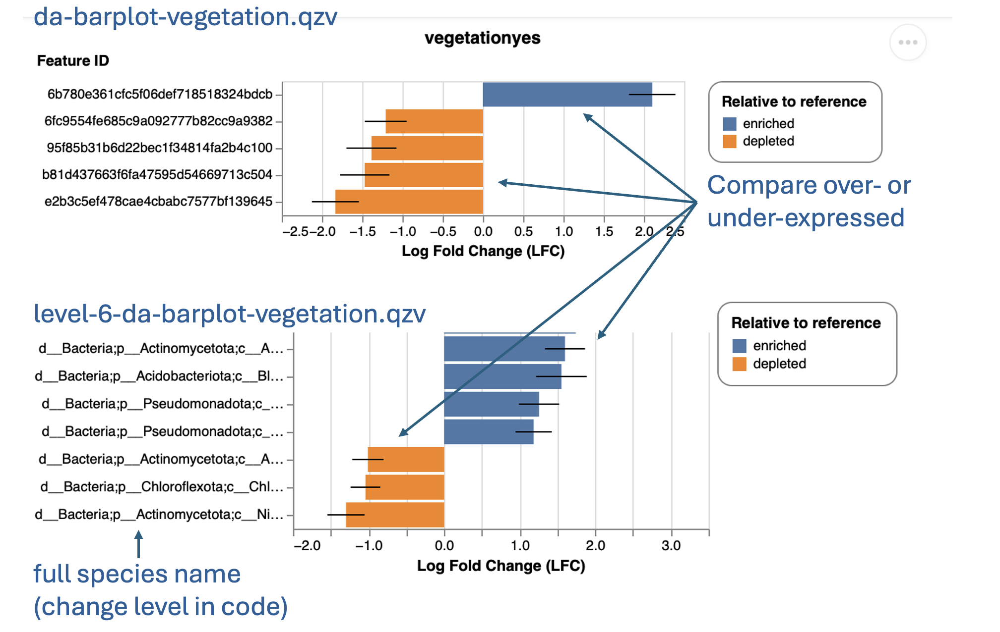

## Differential Abundance

**Files:**
- `da-barplot-vegetation.qzv`
- `level-6-da-barplot-vegetation.qzv`

**Purpose:** Identifies taxa that are significantly different in abundance between experimental groups.

**Interpretation:**
- `da-barplot-vegetation.qzv`: Identifies which species are **over- or under-expressed** among groups (based on feature IDs only).  
- `level-6-da-barplot-vegetation.qzv`: Displays **full taxonomic names** and significance results.  
  - Shows which taxa are **differentially abundant**.  
  - You can customize by changing the taxonomic **level** parameter when running the pipeline. Please check the customization page for the more detailed instruction on this step.

